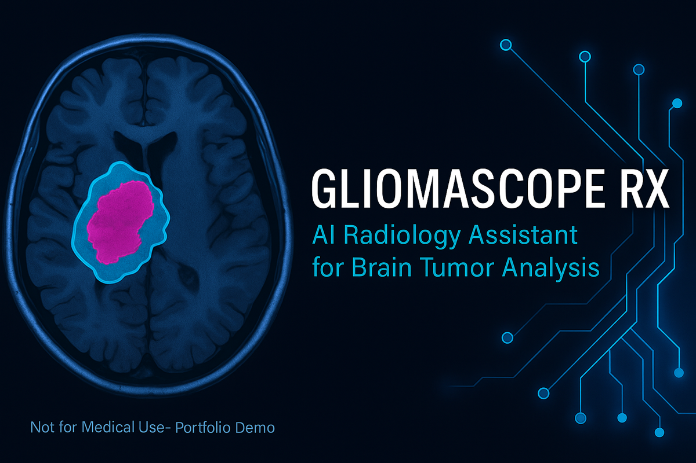

<p align="center">
  
</p>
<p align="center">
  <i><b>GliomaScope RX</b> – AI Radiology Assistant for Brain Tumor Analysis</i><br/>
  <sub>FastAPI • React • Docker • Cloud Run • Gemini 1.5 Pro • MLOps Pipeline</sub>
</p>

# 🧠 GliomaScope RX – AI Radiology Assistant  

> **Disclaimer:** This project is for educational and portfolio demonstration only.  
> It is **not intended for clinical or diagnostic use**.

GliomaScope RX is a one-page AI radiology web application where users can upload brain MRI/CT images and interact with an AI assistant that:
1. Detects and highlights tumor regions (U-Net segmentation overlay).  
2. Predicts tumor size, aggressiveness score, and stage proxy.  
3. Retrieves current research insights via a RAG pipeline (PubMed / clinical trials).  
4. Generates a sample AI prescription report (PDF + email via SendGrid).  

---

## ⚙️ Tech Stack
| Layer | Technology |
|:------|:------------|
| **Frontend** | React + Tailwind CSS (Next.js optional) |
| **Backend** | FastAPI + Uvicorn + Python |
| **Models** | U-Net (Segmentation) • CNN/ViT (Classification) |
| **RAG LLM** | Gemini 1.5 Pro (Student Tier) / GPT-4 (Fallback) |
| **Infra** | Docker • GitHub Actions CI/CD • Cloud Run / Render / HF Spaces |
| **Registry & Monitoring** | Weights & Biases or MLflow • Prometheus + Grafana |
| **Storage** | AWS S3 or Google Cloud Storage (auto-delete after 30 min) |

---

## 🧰 Project Structure

frontend/   → React UI with chat + image overlay
backend/    → FastAPI gateway and ML services
mlops/      → CI/CD, monitoring, model registry
data/       → sample MRI/CT images

---

## 🚀 Core Endpoints
| Endpoint | Function |
|-----------|-----------|
| `POST /upload` | Upload MRI image |
| `POST /analyze` | Segment & predict tumor metrics |
| `POST /chat` | LLM-powered assistant responses |
| `POST /research` | Retrieve PubMed/clinical insights (RAG) |
| `POST /report` | Generate and email PDF report |

---

## 📈 Performance Metrics
- Segmentation IoU / Dice Score  
- Classification AUC / F1  
- API Latency (P50 / P95 ms)  
- Uptime % and Cost per Inference ($)

---

## 🧪 Run Locally
```bash
git clone https://github.com/<your-username>/gliomascope-rx.git
cd gliomascope-rx
docker-compose up --build

Open http://localhost:3000 for frontend,
and http://localhost:8000/docs for API Swagger UI.

⸻

🌐 Live Demo

Frontend: https://gliomascope-rx.vercel.app
Backend: (coming soon)

⸻

🛡️ Disclaimer

This project demonstrates AI + MLOps engineering skills only.
It is not a medical device, and outputs must not be used for clinical decisions.

⸻

📈 Project Roadmap
	•	FastAPI backend skeleton + CI/CD
	•	Frontend upload + chat UI
	•	U-Net segmentation inference pipeline
	•	Severity metrics & visual overlay
	•	RAG (PubMed FAISS + Gemini/GPT-4)
	•	PDF report + SendGrid integration
	•	Monitoring dashboard (W&B or Grafana)

⸻

👩‍💻 Author

Chandan Mohan – M.S. Computer Science, George Washington University
🌐 Portfolio | LinkedIn | GitHub

⸻
```

<p align="center">
  <i>GliomaScope RX – AI Radiology Assistant for Brain Tumor Analysis</i><br/>
  <sub>FastAPI • React • Docker • Cloud Run • Gemini 1.5 Pro • MLOps Pipeline</sub>
</p>

